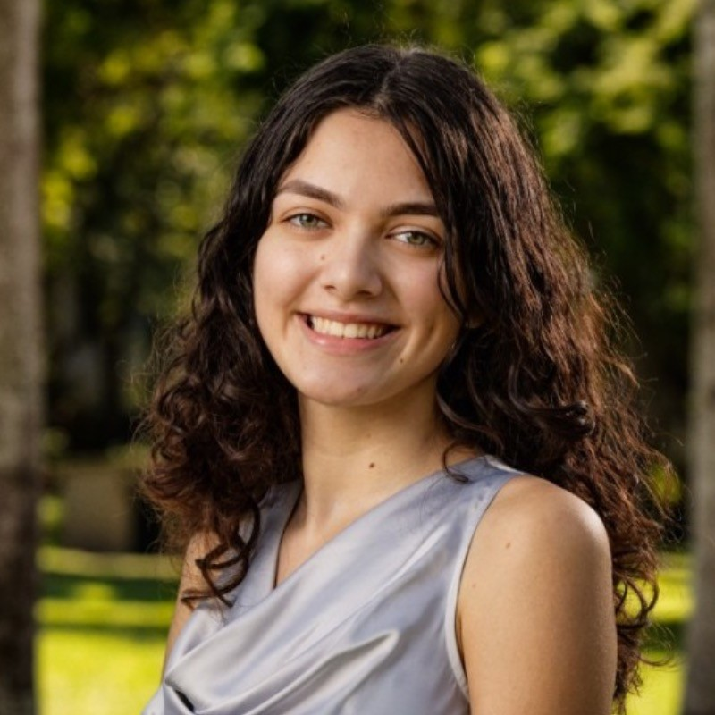

<h1 style="text-align: center; margin-bottom: 10px;">Julia M. Arwari</h1>

```{r, echo=FALSE, fig.align='center', out.width='40%'}

```

Hi! I am an MPH candidate in Environmental Health at Emory University, with a certificate in Data Science. My research focuses on environmental exposures and their impacts on population health.

My recent work includes examining associations between prenatal urinary biomarkers of glyphosate and aminomethylphosphonic acid and oxidative stress in the Illinois Kids Development Study. In addition, I have contributed to applied public health initiatives with The Carter Center’s Trachoma Control Program, supporting geospatial analysis and disease surveillance efforts.

Following graduation, I will join the Caban-Martinez Lab at the University of Miami as a Research Support Specialist, contributing to research on occupational cancers, environmental exposures, and occupational epidemiology.

You can view my some of my projects [here](projects.html).
