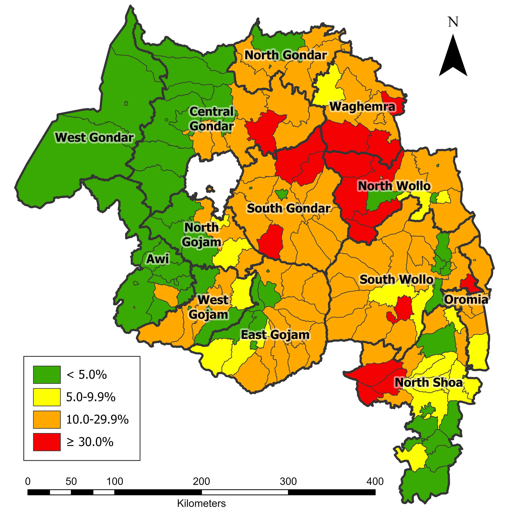
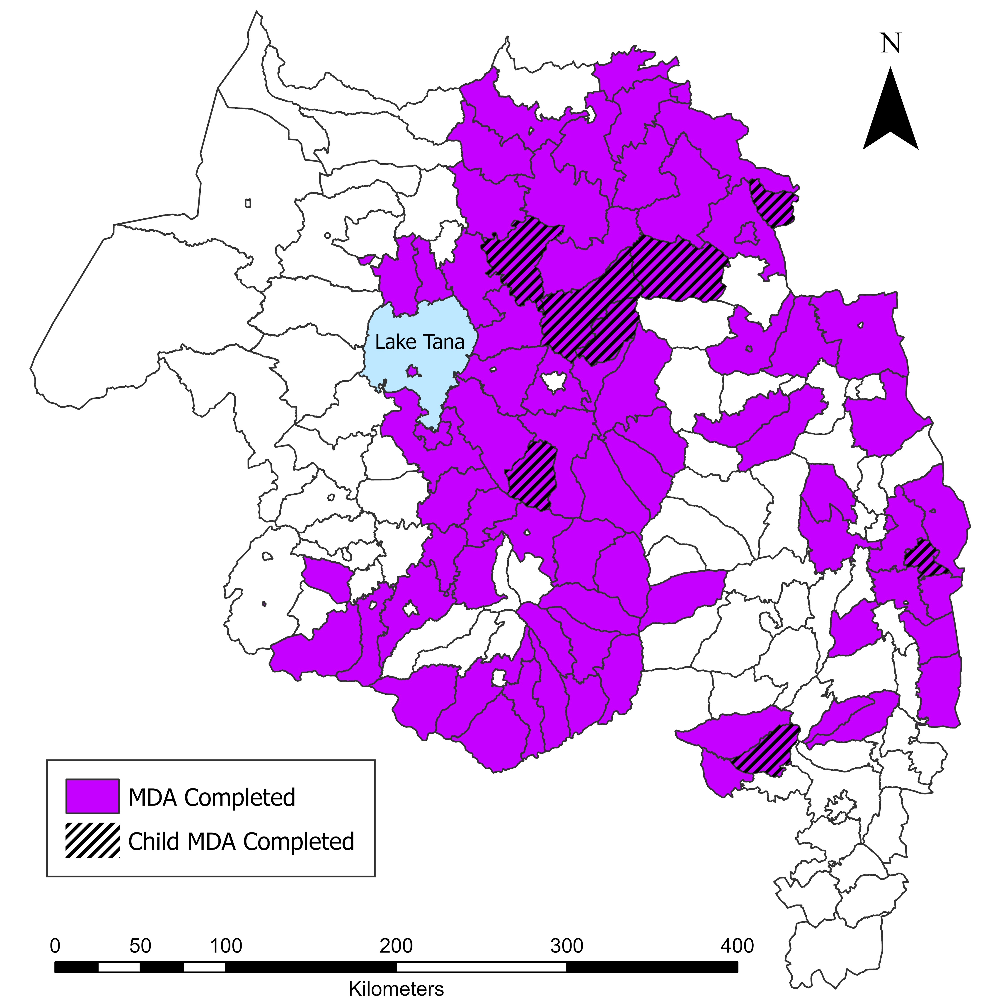
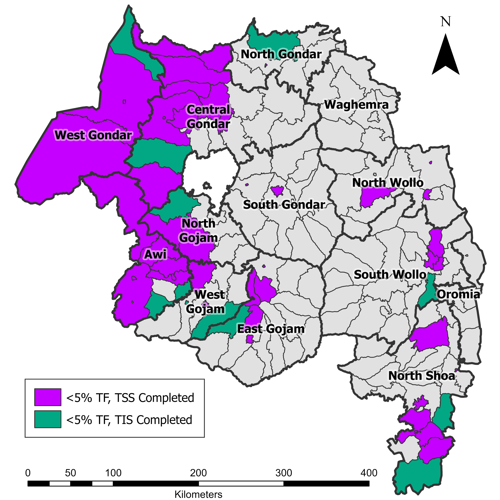

### Interactive Dashboard

This project presents an R Shiny dashboard built using a simulated version of my thesis dataset. It explores associations between prenatal glyphosate and AMPA exposure and oxidative stress biomarkers.

- 🔗 [View Dashboard](https://177rvi-julia-arwari.shinyapps.io/glyphosate-dashboard/)  
- 💻 [GitHub Repository](https://github.com/jarwari/GlyphosateDashboard)

---

### Mapping for The Carter Center

These maps were created in ArcGIS Pro for the Twenty-Seventh Annual Trachoma Control Program Review. A full collection is available on [GitHub](https://github.com/jarwari/2026-Trachoma-Program-Review-Maps/tree/main).

::: columns

::: {.column width="33%"}

<p style="text-align: center; font-weight: 600;">TF Prevalence (2025)</p>

```{r, echo=FALSE, fig.align='center', out.width='95%'}

```

:::

::: {.column width="33%"}

<p style="text-align: center; font-weight: 600;">MDA/CMDA Completed (2025)</p>

```{r, echo=FALSE, fig.align='center', out.width='95%'}

```

:::

::: {.column width="33%"}

<p style="text-align: center; font-weight: 600;">FGC 2 (2025)</p>

```{r, echo=FALSE, fig.align='center', out.width='95%'}

```

:::

:::